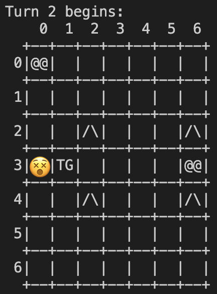

# Mages & Goblins

[toc]

## 基本介绍

`Mages&Goblins`是一个回合制战棋类游戏。在`M x N`的战场(`Field`)上（`M`为战场高度，`N`为战场宽度），玩家控制法师（Mages）通过移动、攻击和释放法术来消灭敌方的哥布林（Goblins）单位。如果玩家成功消灭了所有的敌方哥布林则玩家获胜，否则失败。哥布林的行动将由AI控制。

## 基本任务（25分）
该游戏由C++编写，其基本框架已经搭建完毕并提供给你，但是关键的功能没有实现，你需要实现这些功能，并通过所有的测试案例。注意，通过所有测试案例可以拿到全部的基础总分（25分），但**最终的大作业成绩还取决于能否通过隐藏测试案例**(5分)，为了保证你能通过隐藏测试案例，你需要使用我们提供的参考程序(demo)，对标**自行测试各种边缘情况**，你的测试考虑周到与否将决定你是否能通过隐藏测试案例。

我们提供的文件结构如下：
```
judger_student
|- Mages&Goblins  // 提供的程序框架
|- readme         // 本说明文档
|- source         // 各个任务源程序的位置
|- judger.py      // 测试用Python脚本
|- data           // 各个任务测试用数据
|- maps           // 自行测试用地图
|- demo           // 参考程序
```
### 热身（0分）：阅读并理解程序结构
你首先需要对该项目的结构有基本的了解。游戏项目的源程序结构如下：
```
Mages&Globlins
|- main.cpp         // 程序入口
|- units.h          // 单位类头文件（访问单位的接口）
|- units.cpp        // 单位类的实现
|- field.h          // 战场类头文件（访问战场的接口）
|- field.cpp        // 战场类实现
|- algorithms.h     // 寻路算法头文件
|- algorithms.cpp   // 寻路算法实现
|- engine.h         // 游戏引擎接口
|- engine.cpp       // 游戏引擎的实现（包括和用户交互）
|- cs1604.txt (include the StanfordCppLib) 
```

其主要分为以下几个部分：

1. 单位类的接口和实现 (`units.h`和`units.cpp`)。定义了名为`Unit`的类代表出场单位，关键属性包括单位的`side`（其中`side = true`时为玩家控制的法师单位，否则属于敌方的哥布林单位）。
2. 战场类的接口和实现 (`field.h`和`field.cpp`)。定义了名为`Field`的类代表战场，其有一个包含`Unit`指针的`Grid`容器`units`表示战场。如果`units[i][j]==nullptr`，则说明坐标`(i,j)`没有单位存在，否则`units[i][j]`包含指向坐标`(i,j)`单位的指针。此外该类的`terrains`成员包含地图上每个坐标点的地形。为方便起见`Field`还重载了`<<`操作符用于输出操作。
3. 寻路算法的接口和实现 (`algorithms.h`和`algorithms.cpp`)。定义了敌方哥布林单位确定移动范围和路径的寻路算法，**这两个文件只在最后一个任务中需要**。详见接下来的任务描述。
4. 游戏引擎 (`engine.h`和`engine.cpp`)。定义了回合制游戏进行的主要循环过程，给定一个初始战场`field`，调用`play`函数开始游戏。具体实现中还包括如何和用户进行交互，推动游戏进行。
5. 程序入口(`main.cpp`)。定义了一个初始战场，设定初始单位，并调用`play`函数开始游戏。我们提供的参考实现接口使用`Vector<Unit*> units`来存储和管理所有的单位，你可以改变`play`函数的原型并使用不同的实现方式。

你需要在总体上掌握上述代码结构，为下面的任务打下基础。我们建议在`Mages&Goblins`路径下进行开发与手动调试，完成一个任务后将源代码复制到`source`路径下对应的文件夹中，具体见后续的“测试游戏”和“提交格式部分”。   
### 1. 实现地图和单位的加载与显示（6分）
在初始程序中，我们在`main`函数中定义了一个空的地图。空地图默认地形为平原(`PLAIN`)，并且没有任何单位。**你需要实现一个函数`loadMap`，从输入流中装载一个新的战场地图。**该函数应该定义在`engine.cpp`中，其原型如下：
```
#include <iostream>
#include "field.h"

// Load map
Field* loadMap(std::istream& is);
```
给定一个提供地图信息的输入流`is`，该函数分配（使用`new operator`)并返回一个对应的`Field`对象。 其中，`is`可以绑定在`cin`上，也可以绑定在文件输入流上。

该输入流提供的地图信息格式如下：

* 第一行`M N NT NM NG`:代表当前战场大小为`M x N`，一共有`NT`个特殊地形（除平原），`NM`个我方法师单位和`NG`个敌方哥布林单位。
* 接下来`NT`行特殊地形信息，每行格式为`R C T`，`R`代表行数（row）,`C`代表列数（column)。这一行输入代表在`(R,C)`坐标有一个地形为`T`。`T = W`代表深水(`WATER`)，`T = M`代表高山(`MOUNTAIN`)。你需要在`field.h`文件中添加对应的地形类型来表示它们。
* 接下来`NM`行代表法师单位信息，每行格式为`R C`，代表在`(R,C)`坐标有一个法师单位。
* 接下来`NG`行代表哥布林单位信息，在本任务中每行格式为`R C PG`。`“PG”`为一个固定的字符串，代表在`(R,C)`坐标有一个哥布林。
* 如果因为地图格式错误无法装载，则输出`Failed to load map!`后退出游戏。
* 我们规定地图的大小不超过`20 x 20`
* 我们提供的地图不会出现单位和特殊地形出现在同一个位置的情况。

在读取地图后，你需要修改`field.cpp`中的`ostream& operator<<(ostream& os, const Field& field)`方法，使得能够正确的显示地图：
* 特殊地形必须有如下显示效果：深水显示为`~~`，高山显示为`/\`。
* 法师单位显示为`@@`，哥布林显示为`PG`。
  例如， 下列输入描述了一个`9 x 9`的地图：

```
9 9 10 3 3
4 0 W
4 2 W
4 3 W
4 5 W
4 6 W
4 8 W
2 1 M
2 7 M
6 1 M
6 7 M
0 4 
1 1 
1 7 
8 4 PG
7 1 PG
7 7 PG
```
其地图显示为


本任务的输入格式即为地图输入，输出完整打印的地图（或者`Failed to load map!`）即可。

<div style="page-break-after:always"></div>

### 2. 实现我方单位的移动与施法（7分）

#### 2.1 实现我方单位移动

每回合玩家可以操纵所有单位进行移动，

* 每个单位拥有3点行动力，也就是最多可以走3步。
* 每个单位每一步可以到达上下左右4个临近位置。分别用`W A S D`表示， 如下图所示：

  ```
      W 
  A  @@  D
      S
  ```
  
*  一个格子如果已经有单位存在，那么无法移动到这个格子上。
*  一个格子上如果是特殊地形（高山或深水）, 那么无法移动到这个格子上。
*  在实现移动命令时，你需要考虑目的地坐标是否超出地图边界。

在每个回合开始时，游戏首先会**打印出当前的地图状态**，之后要求玩家**根据我方单位在加载时的顺序**针对每一个单位输入至多3个方向（如果有输入不是`W A S D`，则忽略该输入）并按下回车进行移动，接着是**敌方单位按照加载时的顺序**移动。在每一个友方单位移动之后，游戏会打印出当前的战场状态，敌方单位的移动**不需要**打印地图状态，每回合开始时打印的地图状态就可以反映上一回合中敌方单位的移动。**在任务2中所有的敌方哥布林不会移动**。

以下图为例，游戏打印出初始地图，并首先要求玩家针对第一个输入的，位于`(0,4)`的法师单位输入移动命令：


玩家输入`S A A`，代表向下走一步，向左走两步之后，游戏打印出当前状态并要求玩家操控位于`(1,1)`的下一个单位：


玩家输入`D S W`，由于右侧有单位阻挡，下方有地形阻挡，此单位只向上移动了一步：


最后一个单位移动(`D`)之后，第一回合结束，第二回合开始。游戏会再次打印出当前战场的状态，并要求玩家移动位于`(1,2)`的第一个输入的法师：


#### 2.2 实现施法
除了移动之外，我方单位可以施放两种法术来攻击哥布林，分别是火球术（fireball）和龙卷风（tornado）。在控制单位行动时时可以在移动命令之后额外输入命令来施放这些法术并产生效果。

一个法师单位在移动命令后（*移动命令可以为空*）输入`X` 和方向（`WASD`其中之一）可以从当前所在位置向目标方向施放火球术，其效果为：
* 当无任何障碍物阻挡时，火球将沿着其发射的方向在地图上移动，直到超出地图边界
* 当击中某个单位时，单位将被消灭（无论敌我），火球消失
* 当击中高山时，火球将被阻挡并消散

> 提示：如果一个友方单位被消灭，那么游戏不会再让玩家输入对它的指令。

再次以一开始的地图为例，针对位于`(0,4)`的法师单位向下走一步后向左施放火球术导致位于`(1,1)`位置的法师死亡，下一个需要控制的单位变为`(1,7)`的法师：


一个法师单位在移动命令后输入 `Y`可以从当前位置施放龙卷风，其效果为：
* 如果本单位周围的8个位置存在其他单位，那么将它们按照从中心出发的方向击退1格， 如下图所示
```
                                   TG    TG    TG
     TG TG TG        
     TG @@ TG    ---Tornado--->    TG    @@    TG
     TG TG TG
                                   TG    TG    TG
```
* 如果击退单位的目标位置为深水（WATER），那么这个被击退的单位会落入深水而死亡。
* 如果击退单位的目标位置为高山（MOUNTAIN）或超出了地图范围，那么这个单位不会被击退。
* 如果击退单位的目标位置为另一个单位，那么另一个单位也会被击退，以此类推。如果这个方向上连续的最后一个单位被成功击退，那么所有单位都被击退1格。否则所有单位保持不动。

以另一个地图上的情况为例子：


位于`(5,0)`的法师直接通过输入`Y`施放龙卷风，其效果为：


#### 2.3 胜利条件判断

在每一个回合**开始并打印出当前地图状态之后**，当战场上只存在一方单位时游戏将终止，你需要实现游戏终止的检查。如果场上只存在我方单位时输出“You Win!”, 只存在敌方单位时输出“You Lose!”。

以下图为例，游戏的初始状态为：


输入`X S`, 位于`(0,4)`的法师向下方施放火球术并击杀下方哥布林之后的状态为：


在第二回合开始时，游戏打印当前地图，并判断游戏终止，玩家获胜：


<div style="page-break-after:always"></div>

### 3. 实现巡逻型敌人（Patrol Goblin）（7分）

现在哥布林不再是傻乎乎地停在原地不动了，它现在有了些许的智慧，能够来回地巡逻，在巡逻的过程中如果发现了玩家单位，还会对之进行攻击。

巡逻型哥布林的输入**改为**如下格式：
```
R C PG D L
```
前两个是该哥布林的初始坐标，第三个输入`"PG"`仍然是一个固定的字符串，代表这个单位是一个巡逻型哥布林，最后两个输入`D L`分别是初始时朝向的方向（只可能是`WASD`四种）以及每回合该哥布林的行动力。最简单的情况（没有碰到特殊地形以及玩家单位）时，巡逻哥布林在每回合下会朝着一个方向，消耗`L`点行动力移动`L`步，然后反转方向。我们用下面一个简单的地图来说明：

```
4 4 0 1 1
0 0
3 3 PG A 3
```

在`(3,3)`位置上的巡逻哥布林初始方向往左，每回合行动力为3。我们不对玩家单位进行移动（玩家指令直接输入回车），只观察每回合哥布林的状态，前三个回合哥布林的位置为：

<div>
    <center>
      
       
       
    <br>
  </center>
</div>


可以看到哥布林在来回地巡逻，每回合消耗完行动力之后就反转方向等待下一回合。

#### 3.1 巡逻和攻击策略

具体来说，巡逻型哥布林每回合下会重复如下步骤直到行动终止：

* 哥布林在行动前会根据下面的条件（按优先级从高到低）来决定是否终止该回合的行动：
  * 如果该哥布林上下左右四个方向存在玩家单位，则哥布林会对**上下左右**四个方向进行攻击并**反转**方向，然后终止该回合行动。**注意**哥布林的攻击不会误伤己方单位。
  * 如果当前回合的行动力已耗尽，则**反转**方向，并终止该回合行动
  * 如果前进方向的下一个坐标是这些情况的一种，则**反转**方向，并终止该回合行动：到达地图外，不是平原地形（不能走到水和高山地型上），该坐标已经有了其他单位

* 否则，消耗一点行动力并移动到当前朝向的方向的下一个坐标

当有多个哥布林时，它们的行动顺序按照加载时的顺序，所以有可能出现前一个哥布林移动到一个哥布林的前面，导致这个哥布林反转方向（下面的例子会进行演示）

#### 3.2 示例

我们用下面这个地图来演示，地图中两个哥布林的输入为`6 4 PG S 3`和`6 6 PG D 3`，即它们分别朝向下和向右巡逻，行动力都是3点，在下面的解释中我们用PG1和PG2分别表示这两个哥布林（注意每一回合都是PG1先移动，PG2后移动）：


我们不移动玩家单位，只观察哥布林的行为，第二到第五回合的地图状态如下：

<div>
    <center>
      
       
    <br>
  </center>
</div>

<div>
    <center>
      
       
    <br>
  </center>
</div>


* 第一回合：PG1向下移动但是被高山阻挡，反转方向并结束移动；PG2向右移动了一个单位后发现玩家单位，并对之攻击，然后反转方向并停止该回合的移动
* 第二回合：PG1向上移动了三个单位，行动力耗尽，并反转方向；PG2向左移动了三个单位，行动力耗尽，并反转方向
* 第三回合：PG1向下移动了两个单位后，遇到PG2阻挡，所以反转方向，并停止该回合的移动；PG2向右移动了三个单位，行动力耗尽，并反转方向
* 第四回合：PG1向上移动了三个单位，行动力耗尽，并反转方向；PG2向左移动了三个单位，行动力耗尽，并反转方向
* 第五回合以及之后的回合：PG1会在`(2,4)`到`(5,4)`之间来回巡逻，PG2会在`(6,4)`到`(6,7)`之间来回巡逻

> 提示：如果巡逻哥布林被龙卷风击退，它的朝向不会改变，但是会在新的路径上进行巡逻。

<div style="page-break-after:always"></div>

### 4. 实现追踪型敌人（Tracking Goblin）（5分）

我们将实现追踪型哥布林，它能够在每回合下移动到**视线内**最近的一个玩家的相邻单位（不能移动到玩家上），并对之进行攻击。

追踪型哥布林的输入格式如下：
```
R C TG S
```
前两个是该哥布林的初始坐标，第三个输入`"TG"`是一个固定的字符串，代表这个单位是一个追踪型哥布林，`S`代表这个哥布林的视线范围。我们看下面的例子，该哥布林的位置为`(3,3)`，视野为3：

<div>
    <center>
      
       
       
    <br>
  </center>
</div>

第一张图用红色菱形圈表示哥布林的视野范围，红色圈内有玩家单位`(3,0)`和`(3,6)`，哥布林在第一回合会去找到它们之中距离自己最近的一个，它发现到达`(3,0)`的最短距离是6，而`(3,6)`因为有特殊地形阻挡无法抵达，所以第一回合哥布林会用最短路径移动到`(3,0)`的相邻单位`(2,0)`上，并攻击玩家单位。第二回合时，哥布林的视野内最近的玩家是`(0,0)`，所以它移动到`(1,0)`并攻击玩家单位。

#### 4.1 追踪和攻击策略

哥布林的追踪策略是寻找**视野内**距离最近的一位玩家单位，并计算到达这个玩家单位的**最短路径**，然后在这个路径上移动一定距离（该距离为`min(最短路径长度 - 1)`，最短路径长度减一是因为不能移动到玩家单位上，只能移动到玩家单位的周围）。哥布林移动后，会对它的**上下左右**四个方向进行一次攻击（攻击不会误伤己方单位）。如果视野内没有玩家或者视野内的玩家没有任何一位能够到达，则该回合不动。

哥布林的视野覆盖范围直观上可以理解为上图中的菱形区域，严格的定义为：对于哥布林的坐标`(r,c)`，它的视野范围为`s`的区域中的所有点（用`(x,y`表示）需要满足`abs(r-x)+abs(c-y) <= s`，`abs`为取绝对值函数。

本任务不需要同学们实现最短路径算法，只需调用在`algorithm.h`中提供的`searchShortestPath`函数实现追踪功能即可，`searchShortestPath`的声明如下：

```C++
typedef pair<int, int> point;
pair<int, Vector<point>> searchShortestPath(const Field & field, int row, int col, int trow, int tcol);
```

其输入为地图，起始点`(row,col)`和终点`(trow,tcol)`，函数会返回这两点间的最短距离和最短路径，最短路径中不包含起始点，以上面图二为例，最短路径为`{(2,3),(1,3),(1,2),(1,1),(1,0),(2,0),(3,0)}`。如果两点间不可达，返回的最短距离为-1。

**注意：**一种特殊情况是哥布林的视野范围内的最近玩家单位有多个，即它们的最短距离都相同，这时候需要使用`algorithm.h`中提供的对坐标的排序函数`coordOrder`：

```C++
bool coordOrder(int row1, int col1, int row2, int col2);
```

对于两个坐标分别为`(row1,col1)`和`(row2,col2)`，`coordOrder(row1,col1,row2,col2)`返回true当且仅当`row1<row2`或者`row1==row2 && col1<col2`，我们称`(row1,col1)`在坐标偏序上比`(row2,col2)`小。当有多个最近玩家时，我们选择坐标偏序最小的玩家单位。我们以下面的例子为了，哥布林的视野为3，视野范围内的玩家有`(3,0)`和`(3,6)`，并且他们的最近距离都是3，哥布林会选择走向`(3,0)`因为`(3,0)`的坐标偏序比`(3,6)`小。

<div>
    <center>
      
       
    <br>
  </center>
</div>

<div style="page-break-after:always"></div>

## 调试游戏

为调试游戏，你首先需要准备好一个地图，使用`loadMap`装载生成一个战场，然后在标准输入端输入命令，观察输出端的结果。主函数的示例结构如下：

```c++
int main()
{
    string filename = "map.txt";
    ifstream ifs;
    ifs.open(filename.c_str());
    if (!ifs) {
        cout << "Cannot open the file: " << filename << endl;
        return -1;
    }

	Vector<Unit*> units;
    Field* f = loadMap(ifs);
    if (f == NULL) {
        cout << "Failed to load map!" << endl;
        return -1;
    }
    play(*f, cin, cout，units);

    delete f;
    for (int i = 0; i < units.size(); i++) {delete units[i];}
    
    ifs.close();
    return 0;
}
```

初始代码中已经准备好了3张测试地图（`map1.txt`，`map2.txt`和`map3.txt`）。你也可以设计自己的地图用于调试。

## 测试游戏

我们使用`judger.py`脚本做最终的测试，为此你需要将主函数改为**从`cin`中读取地图及之后的用户命令**，然后将结果输出到**`cout`**。每个任务我们准备了对应的测试案例，放在`data`文件夹中。**你的程序必须通过所有测试案例才能拿到对应任务的满分**。每完成一个任务，你需要将`Mages&Goblins`目录下的代码拷贝到`source`目录下对应的任务文件夹中。特别注意本次作业使用`StanfordCppLib`，因此需要将编译StanfordCppLib产生的cs1604文件夹的**绝对路径**复制到`source/cs1604.txt`下，以让`judger`成功编译你的程序。

```
source
|- 1_task1
|  |- main.cpp
|  ...
|
|- 2_task2
|  |- main.cpp
|  ...
|
|- 3_task3
|  |- main.cpp
|  ...
|
|- 4_task4
|  |- main.cpp
|  ...
|
|- cs1604.txt (include the StanfordCppLib) 
```

然后在Windows命令行中运行
```
python judger.py -1  // 1 代表第1个任务，同理可测试2、3、4任务
```
如果测试通过，输出结果
```
[T1 c1] Correct
[T1 c2] Correct
...
```
如果测试不通过，则会显示输出不对应的地方。为了测试所有的结果，可以直接调用
```
python judger.py
```

## 隐藏测试（5分）
本次大作业有一部分隐藏测试用来测试**所有任务都完成的程序**各种可能出现的极端情况，**通过所有隐藏测试才可以得到满分**。该隐藏测试将不会透露给学生，所以请特别注意自行测试各类边缘情况。自行测试的结果可以和参考程序相对比，参考程序在`demo`文件夹下面。有2个版本：

* `demo1.exe`从`map.txt`中读取地图文件，然后和用户通过**标准输入输出**进行交互。
* `demo2.exe`从`1.in`中读取地图文件和所有用户输入，将结果输出到`1.out`。

前者用来做交互测试，后者用来做文件输入输出的对比测试。此外，调用demo时加上参数`-D`，将进入Debug模式，会显示更多信息。具体使用方式为在`demo`文件夹下打开命令行并执行`.exe`文件即可，如图所示：


## 测试案例中程序终止的规范
在交互式游玩（通过`cin`和`cout`执行）时程序只会在一方单位被完全消灭时终止。但在使用案例进行测试时可能出现因为输入流结束而终止的情况，为了在这种情况下你的程序行为和参考程序一致，请不要更改我们在`engine.cpp`中给出的`play`函数中的基本结构：
```c++
void play(Field& field, istream& is, ostream& os, Vector<Unit*>& units)
{

    int numTurns = 1;
    while (is)
    {
        os << "Turn " << numTurns << " begins:" << endl;
        // Print the new map
        os << field << endl;

        // Check winning
        // Fill in your code here

        // unit moves
        // Fill in your code here

        // Preventing loop in empty program
        // 在你实现了上述功能之后请删除下面的两行代码
        string line;
        getline(is,line);

        numTurns++;
    }
}
```

每个回合中先输出回合数和当前地图情况，然后检查游戏是否结束，之后按输入顺序执行所有友方单位和敌方单位的行动。最后回合数增加并进入下一轮，初始给出的`string line; getline(is, line)`代码只是为了在样板程序直接编译执行时使得程序停顿并等待输入。在实现完任务2中单位的移动之后就可以删除这一段代码（对于每一个友方单位的输入可以使用这样的`getline`方式实现）。

在上述结构中对于输入流`is`的检查只出现在`while`循环刚刚开始的时候，因此当样例输入文件中给出的指令全部执行完毕之后，当前回合内剩余的没有得到操作命令的友方单位视为**不执行任何行动**，程序在当前**回合结束**时结束`while`循环并终止。另外，如果输入文件**恰好**对于每一个友方单位都给出了命令，那么程序可能会由于输入流中还存在文件结束符`EOF`而进入下一个回合，在下个回合中所有友方单位都不执行任何行动，**回合结束**时程序终止，例如`task2`的第一个样例。总之如果测试案例的输入没有使得游戏分出胜负，那么程序会在回合结束时终止。

为了避免考虑上述的边缘情况，请保持上述`play`函数的基本结构，同时对于每个友方单位请使用`getline()`函数读取其输入，不增加任何额外的输入流判断。遵守上述规范后，你的程序在交互式执行和文件流执行时的行为都会和参考程序相同。

## 提交文件格式
你需要提交的文件结构应该类似如下形式：

```
<your student number>.zip
|- 1_task1
|  |- main.cpp
|  ...
|
|- 2_task2
|  |- main.cpp
|  ...
|
|- 3_task3
|  |- main.cpp
|  ...
|
|- 4_task4
|  |- main.cpp
|  ...
|
|- cs1604.txt (include the StanfordCppLib) 
```